# App Flow & User Navigation Document

## Society Maintenance & Water Billing Management System

| Field | Value |
| --- | --- |
| **Document version** | 1.0.0 |
| **Status** | Phase 1 ✅ · Phase 2 ✅ · Phases 3–6 planned |
| **Companion docs** | PRD (product), TRD (technical), `APP_FLOW.md` (this document) |
| **Demo tenant** | Shyamved Residency, Naroda, Ahmedabad |
| **Repository** | `D:\SHYAMVED AUTOMATE\society-management` |
| **Audience** | UX, product, engineering, AI coding agents |

---

## Legend

| Symbol | Meaning |
| --- | --- |
| ✅ | Screen or flow **implemented** in codebase |
| 🔜 | Route reserved in nav / TRD; **not yet built** |
| 🛡️ | Enforced by middleware + layout + server action |

---

## 1. Executive Summary

This document defines **how users move through the application** — not how data is stored or secured (see TRD). It maps real routes, navigation shells, operational workflows, and planned screens for Phases 3–6.

**What exists today:**

- **Authentication** with role-based redirect (email for admins, phone OTP for residents)
- **Three navigation shells:** Chairman sidebar, Office Man sidebar, Resident bottom nav
- **Phase 2 operational flows:** resident/house CRUD, block management, family members, society settings, water rate history
- **Search & filter** on resident lists (URL-driven, mobile-friendly cards)
- **Placeholder dashboards** awaiting Phase 5 analytics

**Design intent:** Indian society staff complete daily tasks in **under 30 seconds** on mobile — search a flat, record a reading, confirm cash — without deep menu nesting.

---

## 2. Application Navigation Philosophy

### 2.1 Core principles

| Principle | Application |
| --- | --- |
| **Role-first routing** | Each role lives under its own URL prefix (`/admin`, `/office`, `/resident`) |
| **Shallow hierarchy** | Max 2 levels: list → detail. No nested settings trees |
| **Task over taxonomy** | Office nav labels tasks (“Water Units”, “Cash Payments”) not database tables |
| **URL as state** | Filters (`?q=`, `?block=`, `?occupancy=`) are shareable and SSR-friendly |
| **Same task, same screen** | Chairman and Office Man share house forms; Chairman adds settings & block delete |
| **Mobile defaults** | Residents use bottom nav; admins use cards on small screens |

### 2.2 What we avoid

- Desktop-only data tables without card fallbacks
- Multi-step wizards for simple house creation (single scrollable form)
- Duplicate CRUD screens per role when one component with `redirectBase` suffices
- Trusting client-side navigation for security (middleware always wins)

---

## 3. Mobile-First Navigation Strategy

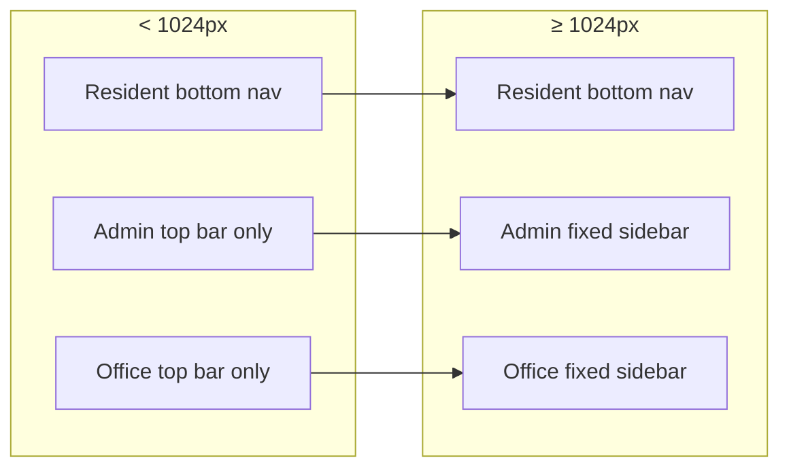

| Breakpoint | Chairman / Office | Resident |
| --- | --- | --- |
| Mobile | Top bar + logo; **no hamburger drawer yet** — primary nav via direct links from dashboard cards (Phase 5) or URL entry | Fixed **bottom nav** (5 items), `pb-20` content padding |
| Tablet / Desktop | Fixed **left sidebar** 256px (`lg:ml-64` main offset) | Same bottom nav (thumb-first even on tablet) |

**Safe area:** Resident nav uses `safe-area-pb` for notched devices.

---

## 4. Role-Based User Flows

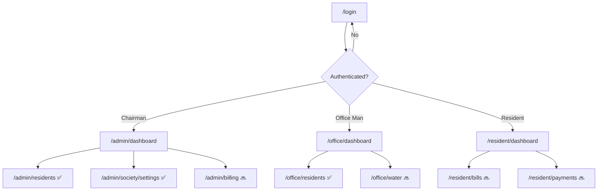

| Role | Entry after login | Primary daily tasks (MVP target) |
| --- | --- | --- |
| **Chairman** | `/admin/dashboard` | Oversight, settings, penalty waiver, reports |
| **Office Man** | `/office/dashboard` | Water entry, cash payments, resident lookup |
| **Resident** | `/resident/dashboard` | View bill, pay UPI, receipts, notices |

---

## 5. Authentication Flows

### 5.1 Login screen ✅ `/login`

**Layout:** Full-viewport gradient (`gradient-page`), centered `glass-card`.

**Mode switcher:** `📱 Mobile OTP` | `✉️ Email` (default tab: phone for resident-first market).

#### Email flow (Chairman / Office Man)

| Step | User action | System behavior |
| --- | --- | --- |
| 1 | Select Email tab | Clear prior errors |
| 2 | Enter email + password, Submit | `signInWithEmail` server action |
| 3 | — | Supabase `signInWithPassword` |
| 4 | — | Load `users` profile: `role`, `is_active` |
| 5a | Profile missing / inactive | `signOut`, show error, stay on `/login` |
| 5b | Success | `revalidatePath`, **redirect** `ROLE_HOME_ROUTES[role]` |

#### Phone OTP flow (Residents)

| Step | User action | System behavior |
| --- | --- | --- |
| 1 | Select Mobile OTP tab | `phoneStep = 'number'` |
| 2 | Enter 10-digit number, Send OTP | `sendPhoneOtp` → normalize `+91`, `signInWithOtp` |
| 3 | Enter 6-digit OTP, Verify | `verifyPhoneOtp` |
| 4 | — | Profile check + redirect `/resident/dashboard` |
| — | Change number | Back button → `phoneStep = 'number'` |

### 5.2 Post-login redirect matrix 🛡️

| Source | Condition | Destination |
| --- | --- | --- |
| `/` | No session | `/login` |
| `/` | Has session | Role home |
| `/login` | Has session | Role home (middleware) |
| Protected route | Wrong role prefix | Role home |
| Protected route | `is_active = false` | `/login?error=account_deactivated` |
| Any protected | No session | `/login?redirect=<path>` |

### 5.3 Sign out ✅

**Trigger:** `SignOutButton` in admin/office sidebar footer or compact mobile header.

**Flow:** `signOut` server action → `revalidatePath` → redirect `/login`.

---

## 6. Chairman User Journey

### 6.1 Journey map (current + planned)

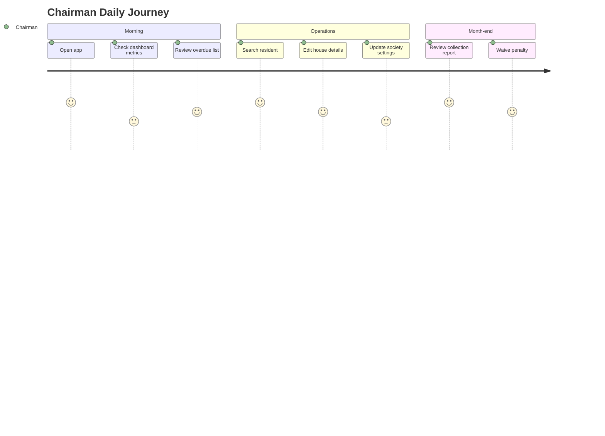

### 6.2 Implemented paths (Phase 2)

1. Login (email) → Dashboard
2. Dashboard → **Residents** → Search / filter → House card → Detail
3. Dashboard → **Settings** → Edit maintenance window / penalty → Save
4. Settings → **Water rate** → Add new rate with effective date
5. Residents → **Block Manager** → Add block / delete empty block

### 6.3 Chairman-only actions

| Action | Screen | Restriction |
| --- | --- | --- |
| Society settings update | `/admin/society/settings` | `requireChairman` |
| Water rate create | Settings → Water Rate section | `requireChairman` |
| Delete block | Residents → Block Manager | `deleteBlock` chairman only |
| Deactivate house | House detail (form `is_active`) | `deactivateHouse` chairman only |

---

## 7. Office Man User Journey

### 7.1 Journey map

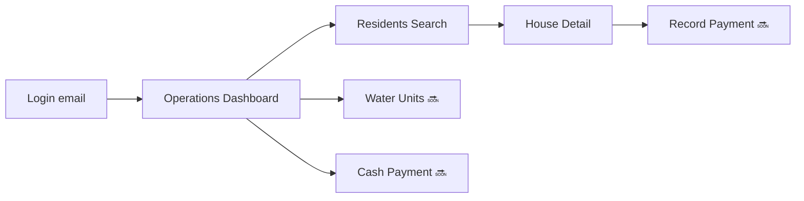

### 7.2 Implemented paths

1. Login → `/office/dashboard`
2. Sidebar **Residents** → list (active houses only) → Add house / open detail
3. House detail uses shared `HouseForm` with `redirectBase="/office/residents"`

### 7.3 Office vs Chairman differences

| Feature | Chairman (`/admin/...`) | Office (`/office/...`) |
| --- | --- | --- |
| Resident list search | Client `ResidentSearch` (router.push) | Native GET form submit |
| Block Manager | ✅ Visible | ❌ Not shown |
| Occupancy filter | ✅ | ❌ (block filter only) |
| Society settings | ✅ | ❌ No nav item |
| Sidebar “Soon” items | Billing, Payments, Expenses, Notices | Water, Bills, Cash, Expenses |

---

## 8. Resident User Journey

### 8.1 Implemented

- Login (phone OTP) → `/resident/dashboard`
- Dashboard shows: greeting, **placeholder** current bill card, placeholder notices

### 8.2 Bottom navigation (defined in layout; partial routes)

| Tab | Route | Status |
| --- | --- | --- |
| Home | `/resident/dashboard` | ✅ Placeholder UI |
| Bills | `/resident/bills` | 🔜 Phase 3 |
| Payments | `/resident/payments` | 🔜 Phase 4 |
| Notices | `/resident/notices` | 🔜 Phase 6 |
| Profile | `/resident/profile` | 🔜 Phase 2+ (house self-view) |

**Note:** Tapping Bills/Payments/Notices/Profile today will hit **404** until routes are added. Phase 6 should add `not-found` under `/resident` or stub pages.

### 8.3 Target payment journey 🔜

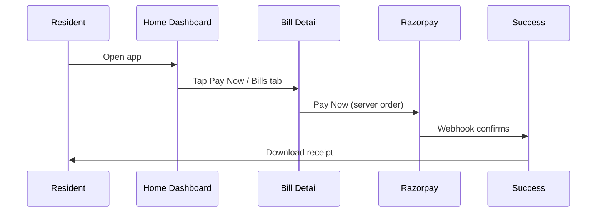

---

## 9. Dashboard Navigation Structure

### 9.1 Chairman dashboard ✅ `/admin/dashboard`

**Purpose:** Financial oversight (Phase 5 will populate metrics).

**Current UI:**

- 4 metric cards: Total Houses, Collected, Pending, Overdue (all `—`)
- Phase status message

**Planned deep links (Phase 5):**

| Card tap | Destination |
| --- | --- |
| Pending / Overdue | `/admin/billing?status=pending` |
| Collected | `/admin/payments` |
| Total Houses | `/admin/residents` |

### 9.2 Office dashboard ✅ `/office/dashboard`

**Metrics (placeholder):** Pending Water Entry, Unpaid Bills, Cash Collected Today, Overdue Houses.

**Planned quick actions (Phase 3–4):**

- “Enter water units” → `/office/water`
- “Record cash payment” → `/office/payments`

### 9.3 Resident dashboard ✅ `/resident/dashboard`

**Sections:**

1. Header — name, society
2. Current bill card — amount, due date, **Pay Now** (disabled until Phase 4)
3. Latest notices — list preview (Phase 6)

---

## 10. Route Hierarchy

```
/                           ✅ → role redirect
/login                      ✅ public
/auth/callback              ✅ public

/admin/                     🛡️ chairman only
  dashboard/                ✅
  residents/                ✅ list
    new/                    ✅ create
    [id]/                   ✅ detail + edit + family
  society/settings/         ✅ chairman only (layout + requireChairman)
  billing/                  🔜
  payments/                 🔜
  expenses/                 🔜
  notices/                  🔜

/office/                    🛡️ office_man only
  dashboard/                ✅
  residents/                ✅
    new/                    ✅
    [id]/                   ✅
  water/                    🔜
  billing/                  🔜
  payments/                 🔜
  expenses/                 🔜

/resident/                  🛡️ resident only
  dashboard/                ✅
  bills/                    🔜
  payments/                 🔜
  notices/                  🔜
  profile/                  🔜

/api/webhooks/razorpay      🔜 public (signature auth)
```

---

## 11. App Screen Mapping

| Screen ID | Route | Role | Phase | Component type |
| --- | --- | --- | --- | --- |
| SCR-001 | `/login` | Public | 1 | Client page |
| SCR-010 | `/admin/dashboard` | Chairman | 1 | Server |
| SCR-011 | `/admin/residents` | Chairman | 2 | Server + URL filters |
| SCR-012 | `/admin/residents/new` | Chairman | 2 | Server + `HouseForm` |
| SCR-013 | `/admin/residents/[id]` | Chairman | 2 | Server + client sections |
| SCR-014 | `/admin/society/settings` | Chairman | 2 | Server + client forms |
| SCR-020 | `/office/dashboard` | Office | 1 | Server |
| SCR-021 | `/office/residents` | Office | 2 | Server |
| SCR-022 | `/office/residents/new` | Office | 2 | Server + `HouseForm` |
| SCR-023 | `/office/residents/[id]` | Office | 2 | Server |
| SCR-030 | `/resident/dashboard` | Resident | 1 | Server |
| SCR-031 | `/resident/bills` | Resident | 3 | 🔜 |
| SCR-032 | `/resident/bills/[id]` | Resident | 3 | 🔜 |
| SCR-040 | `/admin/billing` | Chairman | 3 | 🔜 |
| SCR-050 | `/office/water` | Office | 3 | 🔜 |
| SCR-060 | `/office/payments` | Office | 4 | 🔜 |

---

## 12. Navigation Tree Structure

```
App
├── Login (public)
├── Chairman (/admin)
│   ├── Dashboard ✅
│   ├── Residents ✅
│   │   ├── List + Search + Filters
│   │   ├── New House
│   │   └── House Detail
│   │       ├── Summary card
│   │       ├── Edit form
│   │       └── Family members
│   ├── Billing 🔜
│   ├── Payments 🔜
│   ├── Expenses 🔜
│   ├── Notices 🔜
│   └── Settings ✅
│       ├── Society config form
│       └── Water rates
├── Office (/office)
│   ├── Dashboard ✅
│   ├── Residents ✅ (subset of chairman)
│   ├── Water Units 🔜
│   ├── Bills 🔜
│   ├── Cash Payments 🔜
│   └── Expenses 🔜
└── Resident (/resident)
    ├── Home ✅
    ├── Bills 🔜
    ├── Payments 🔜
    ├── Notices 🔜
    └── Profile 🔜
```

---

## 13. Billing Lifecycle Flow

**Status:** Backend schema ready; UI 🔜 Phase 3.

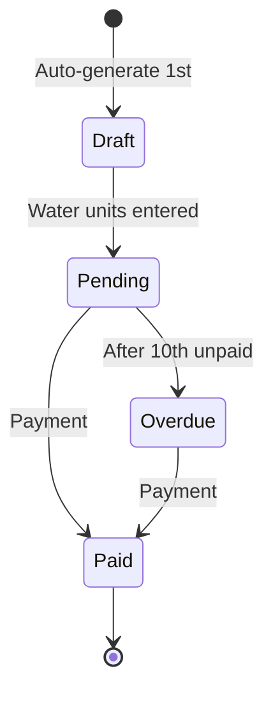

### 13.1 Admin billing UX (planned)

| Step | Actor | Screen | Action |
| --- | --- | --- | --- |
| 1 | System | — | Cron creates `draft` bills |
| 2 | Office | `/office/water` | Enter units per house |
| 3 | Office | `/office/billing` | Review month, finalize → `pending` |
| 4 | Resident | `/resident/bills` | View amount (penalty dynamic) |
| 5 | — | — | After 10th → status `overdue` (job or on-read) |
| 6 | Resident / Office | Payment screens | UPI or cash |
| 7 | System | — | `paid` + receipt |

### 13.2 Resident visibility rule

Residents only see bills for **their** `house_id` (RLS). Bill card on dashboard shows **current billing month** bill.

---

## 14. Payment Lifecycle Flow

**Status:** 🔜 Phase 4.

### 14.1 UPI (resident)

| Step | Screen | User action | Redirect / feedback |
| --- | --- | --- | --- |
| 1 | Bill detail | Tap Pay Now | Loading state on button |
| 2 | — | Razorpay checkout modal | External UPI app |
| 3 | `/resident/payments/success` | — | Success animation; link to receipt |
| 4 | Receipt viewer | Download PDF | Stay or back to home |

**Critical UX:** Do not show “Paid” until webhook confirms — show “Processing…” with poll/realtime (Phase 6).

### 14.2 Cash (office)

| Step | Screen | User action |
| --- | --- | --- |
| 1 | `/office/residents` | Search house |
| 2 | House or `/office/payments` | Select pending bill |
| 3 | Cash modal | Confirm amount + month |
| 4 | — | Success toast + print receipt option |

---

## 15. Water Billing Workflow

### 15.1 Planned screen: `/office/water` 🔜

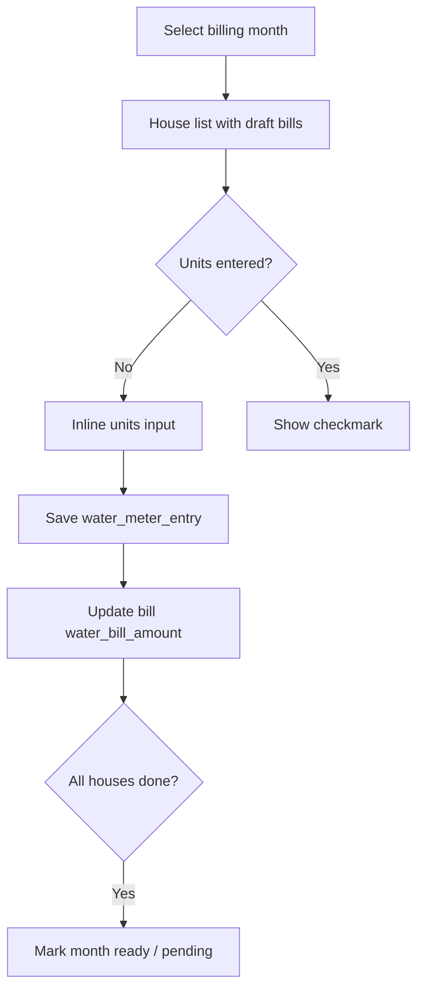

### 15.2 Per-house data entry (MVP)

| Field | Input | Validation |
| --- | --- | --- |
| Billing month | Month picker (default current) | Required |
| Units consumed | Numeric | > 0 |
| Unit price | Auto from active `water_rates` | Read-only snapshot |
| Previous/current reading | Optional | Phase 3+ |

### 15.3 Office daily pattern

1. Open dashboard → see “Pending Water Entry” count
2. Tap → water screen filtered to missing entries
3. Enter units house-by-house (card list, not table)
4. Return to dashboard

---

## 16. Resident Registration Workflow

**Interpretation:** Registering a **house and occupants** (not self-signup). ✅ Phase 2.

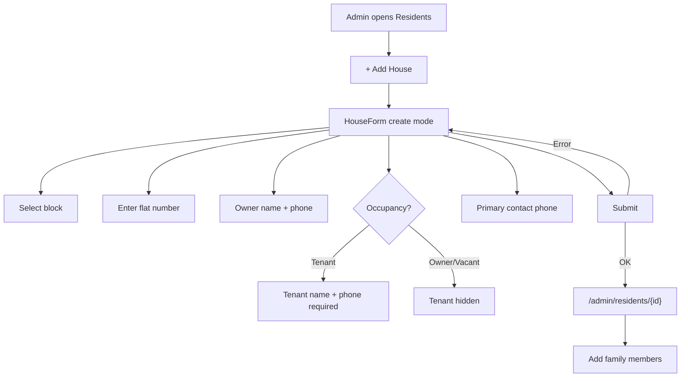

### 16.1 Validation states (implemented)

| Rule | UX feedback |
| --- | --- |
| Duplicate house number | Server: `23505` → “House already exists” |
| Tenant occupied without tenant fields | Zod schema error inline |
| Invalid block | “Invalid block selected” |
| Permission denied | AlertBanner error |

### 16.2 Redirect behavior

| Mode | On success |
| --- | --- |
| Create | `router.push(redirectBase/{id})` — default `/admin/residents` |
| Edit | Stay on page; green AlertBanner “House updated” |

---

## 17. House Management Workflow

### 17.1 List screen ✅

**Routes:** `/admin/residents`, `/office/residents`

**Layout:**

1. `PageHeader` + “Add House” CTA
2. Search row
3. Occupancy chips (admin only)
4. Block tabs with counts
5. Block Manager card (admin only)
6. Responsive **card grid** (1 → 2 → 3 columns)

**Card tap:** Navigate to `/…/residents/[id]`.

### 17.2 Detail screen ✅

**Layout (mobile stacks; desktop 1+2 columns):**

| Zone | Content |
| --- | --- |
| Left | Status card: owner, tenant, primary contact, water meter, inactive warning |
| Right | `HouseForm` edit + `FamilyMembersSection` |

**Back navigation:** `← Residents` → list (preserves filters if browser back).

### 17.3 House number convention

- User may enter `101` or `A-101`
- Server prefixes with block name if missing → `A-101`

---

## 18. Family Member Workflow

### 18.1 Section location ✅

Embedded in `/admin/residents/[id]` and `/office/residents/[id]` — not a separate route.

### 18.2 Add member flow

| Step | Action |
| --- | --- |
| 1 | Tap “Add member” → inline form expands |
| 2 | Fill name, relationship, age, phone, email |
| 3 | Optional: “Set as primary contact” checkbox |
| 4 | Submit → `createFamilyMember` |
| 5 | Success → AlertBanner; form collapses; list refreshes (RSC revalidate) |

### 18.3 Primary contact rules

| Rule | Behavior |
| --- | --- |
| Only one primary per house | Server clears other `is_primary_contact` flags |
| Set primary on existing | “Set as primary” button per member row |
| Delete primary | Blocked — must assign another first |
| Primary vs house phone | `primary_contact_phone` on house is separate field; member flag is for family display |

### 18.4 Remove member

`confirm()` dialog → `deleteFamilyMember` → success toast.

---

## 19. Water Rate Update Workflow

### 19.1 Entry point ✅

**Chairman only:** Sidebar **Settings** → `/admin/society/settings` → Water Rate Management.

### 19.2 Create new rate flow

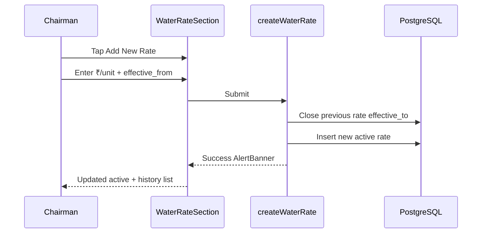

### 19.3 Display

- **Active rate** — large emerald price
- **History** — past rates with effective dates
- Empty state if no rate: warning + CTA to add

### 19.4 Impact on billing (Phase 3)

- New bills snapshot `water_unit_price` at generation
- Existing draft bills for month may need manual refresh when rate changes mid-month (admin policy; document in Phase 3)

---

## 20. Notice & Event Flow

**Status:** 🔜 Phase 6. Schema + RLS exist; no UI routes yet.

### 20.1 Chairman / Office (planned)

| Step | Screen |
| --- | --- |
| 1 | `/admin/notices` list (draft / published tabs) |
| 2 | Create → form: title, type, priority, audience, block |
| 3 | Publish → status `published`, `published_at` set |
| 4 | Residents see in `/resident/notices` |

### 20.2 Resident (planned)

| Step | Screen |
| --- | --- |
| 1 | Bottom nav **Notices** |
| 2 | List cards sorted by priority + date |
| 3 | Tap → detail (full markdown description) |
| 4 | Emergency → red badge + pin to dashboard |

### 20.3 Events (planned)

- `/resident/notices` tab or separate **Events** section on dashboard
- Upcoming events sorted by `event_date`

---

## 21. Error State Navigation

| Scenario | User sees | Navigation |
| --- | --- | --- |
| Invalid credentials | Red inline alert on `/login` | Stay |
| Deactivated account | `/login?error=account_deactivated` | Stay |
| Wrong role URL | Middleware redirect | Role home (no error toast) |
| House not found | `not-found.tsx` under admin/office | Link → dashboard |
| Permission denied (action) | AlertBanner on same page | Stay |
| Network / server error | Generic AlertBanner | Stay, retry |
| Paid bill edit (Phase 3) | Trigger error message | Stay |

**Admin/office `not-found.tsx` ✅:** Glass card + “Back to Dashboard” button.

---

## 22. Empty State UX

**Component:** `EmptyState` from `@/components/ui/PageUI`.

| Context | Icon | Title | CTA |
| --- | --- | --- | --- |
| No houses (search) | 🏠 | No houses found | Adjust search or Add House |
| No houses (fresh) | 🏠 | No houses found | Add First House |
| No family members | (in section) | No members yet | Add member |
| No water rate history | 📋 | No rate history | — |
| Dashboard metrics | — | `—` placeholders | Phase 5 |

**Copy tone:** Short, operational (“Start by adding the first house”) — not marketing fluff.

---

## 23. Search & Filtering Flow

### 23.1 Chairman search ✅ (client-side navigation)

```
User types → Submit
  → router.push(`/admin/residents?q={q}&block={block}&occupancy={occ}`)
  → Server re-renders getHouses({ search, blockId, occupancy })
```

**Fields searched:** `house_number`, `owner_name`, `tenant_name`, `primary_contact_phone`, `owner_phone`.

### 23.2 Office search ✅ (progressive enhancement)

```
GET form → /office/residents?q=...
  → Same getHouses query
  → Works without JavaScript
```

### 23.3 Filter chips

| Filter | URL param | Values |
| --- | --- | --- |
| Block | `block` | UUID or empty (all) |
| Occupancy | `occupancy` | `owner_occupied`, `tenant_occupied`, `vacant`, or empty |
| Active | `active=false` | Admin only — show inactive |

**Mobile:** Chips wrap; horizontal scroll optional enhancement.

### 23.4 Planned filters (Phase 3+)

| Filter | URL | Use |
| --- | --- | --- |
| Payment status | `?bill_status=overdue` | Office collection drive |
| Billing month | `?month=2025-05` | Monthly billing run |

---

## 24. Audit Log Visibility Flow

**Status:** Write path ✅ (`writeAuditLog`); Read UI 🔜 Phase 5.

### 24.1 What gets logged today (Phase 2)

| Action | Trigger screen |
| --- | --- |
| `house_created` | Create house |
| `house_updated` | Update house / deactivate |
| `resident_added` | Add family member |
| `resident_removed` | Delete member |
| `settings_updated` | Society settings / water rate |

### 24.2 Planned chairman view 🔜

**Route:** `/admin/audit` or section under Settings.

| Step | Behavior |
| --- | --- |
| 1 | Chairman opens audit log |
| 2 | Paginated list: date, actor, action, entity |
| 3 | Tap row → expand `previous_value` / `new_value` JSON |

**Resident / Office:** No access (RLS chairman SELECT only).

---

## 25. Realtime UX Flow

**Status:** 🔜 Phase 6.

| Event | Resident UX | Admin UX |
| --- | --- | --- |
| Bill → paid | Bill card spinner → “Paid” badge | Dashboard metric increment |
| Notice published | Badge on Notices tab | — |
| Payment processing | “Confirming payment…” banner | — |

**Rules:**

- Realtime updates UI only; never initiate payment success solely from client subscription
- Unsubscribe on `useEffect` cleanup when leaving bill page

---

## 26. Responsive Mobile UX Rules

| Rule | Implementation |
| --- | --- |
| Content padding | Admin: `p-4 pt-16` mobile, `lg:p-8` desktop |
| Touch targets | Buttons `py-2.5`, bottom nav `min-w-[3rem]` |
| Forms | Single column; full-width inputs `.input` |
| Cards | Full-width tap targets on mobile list |
| Typography | Page titles `text-xl` mobile, `text-2xl` desktop |
| Hover states | Card `hover:-translate-y-0.5` desktop; active states on touch |
| Tables | **Not used** for house lists — cards only |

---

## 27. Navigation Guards & Redirect Logic

### 27.1 Middleware layer 🛡️ `src/middleware.ts`

See TRD §12. Summary:

- Webhook paths bypass auth
- Session refresh via `getUser()`
- Role prefix enforcement

### 27.2 Layout layer 🛡️

| Layout | Guard |
| --- | --- |
| `admin/layout.tsx` | `profile.role === 'chairman'` else `/login` |
| `office/layout.tsx` | `profile.role === 'office_man'` |
| `resident/layout.tsx` | `profile.role === 'resident'` |

### 27.3 Page-level guards

| Page | Extra guard |
| --- | --- |
| `/admin/society/settings` | `requireChairman()` → catch redirect `/admin/dashboard` |

### 27.4 Server action guards 🛡️

All mutations: `requireAdmin()` or `requireChairman()` before Zod + DB.

---

## 28. Permission-Based Route Restrictions

| Route pattern | Chairman | Office Man | Resident |
| --- | :---: | :---: | :---: |
| `/admin/*` | ✅ | ❌ → redirect `/office/dashboard` | ❌ → `/resident/dashboard` |
| `/office/*` | ❌ → `/admin/dashboard` | ✅ | ❌ |
| `/resident/*` | ❌ | ❌ | ✅ |
| `/admin/society/settings` | ✅ | ❌ (no link) | ❌ |
| `/login` | ✅ public | ✅ | ✅ |
| Sidebar “Soon” | Disabled `href="#"` | Same | N/A |

---

## 29. Form Submission Lifecycle

**Pattern used across Phase 2** (`HouseForm`, `FamilyMembersSection`, `SocietySettingsForm`, `WaterRateSection`):

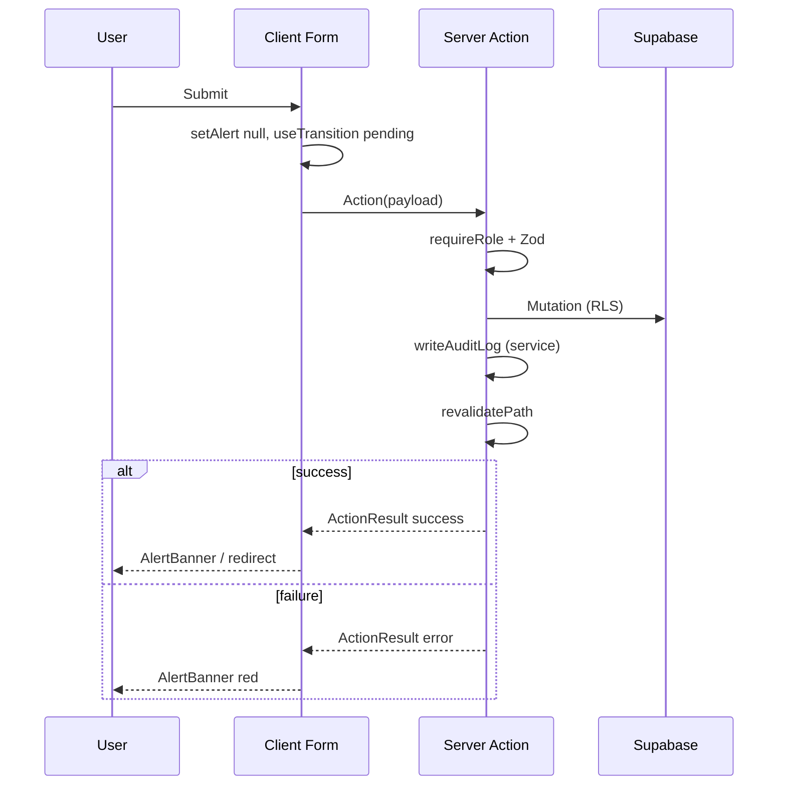

| State | UI |
| --- | --- |
| Idle | Normal inputs |
| Pending | `disabled` on inputs + button, reduced opacity |
| Success | Green `AlertBanner` or navigate |
| Error | Red `AlertBanner`, inline `FormError` per field (where used) |

**No double-submit:** `useTransition` blocks duplicate clicks while pending.

---

## 30. Loading State UX

| Context | Pattern |
| --- | --- |
| Page navigation | Server Components — Next.js `loading.tsx` 🔜 optional |
| Form submit | Button disabled + pending transition |
| Search (admin) | Full page navigation — implicit loading via RSC |
| Dashboard metrics | Skeleton class `.skeleton` 🔜 Phase 5 |
| List pages | No skeleton yet — future `loading.tsx` with card shimmer |

**Resident bill pay:** Spinner on Pay Now; disable double tap (Phase 4).

---

## 31. Success & Failure UX

### 31.1 AlertBanner types ✅

| Type | Color | Use |
| --- | --- | --- |
| `success` | Emerald | Saved, member added, rate created |
| `error` | Red | Validation, permission, DB errors |
| `warning` | Amber | Inactive house, missing water rate |
| `info` | Indigo | Neutral notices |

### 31.2 Confirm dialogs

| Action | Pattern |
| --- | --- |
| Delete family member | `confirm()` native |
| Delete block | `confirm()` native |

### 31.3 Payment outcomes 🔜

| Outcome | Screen |
| --- | --- |
| UPI success | `/resident/payments/success?id=` |
| UPI failed | Bill detail + retry CTA |
| Cash recorded | Toast + optional print receipt |

---

## 32. Notification Flow

**MVP scope:** In-app only (no SMS/WhatsApp).

### 32.1 Planned model 🔜

| Type | Indicator | Storage |
| --- | --- | --- |
| New notice | Badge on Notices tab | Optional `notifications` table Phase 6 |
| Bill overdue | Badge on Bills tab | Derived from bill status |
| Payment confirmed | Transient toast | No persist |

### 32.2 Resident dashboard (Phase 6)

- “Unread” dot on notice cards
- Mark read on open (client local or DB)

---

## 33. Deep Link Strategy

| URL | Purpose |
| --- | --- |
| `/login?redirect=/admin/residents/abc` | Post-login return 🛡️ middleware sets redirect param; 🔜 login action should honor |
| `/admin/residents?q=A-101` | Shareable search |
| `/admin/residents?block={uuid}` | Block-filtered view |
| `/resident/bills/{id}` 🔜 | Payment link from WhatsApp (future) |

**PWA / manifest (Phase 6):** `start_url` → `/login` or `/resident/dashboard` if session exists.

---

## 34. Breadcrumb Strategy

**MVP:** No breadcrumb component — **back links** only.

| Screen | Back target |
| --- | --- |
| House detail | `← Residents` |
| New house | `← Back` |
| Society settings | Sidebar (no back; top-level nav item) |

**Rationale:** Mobile screens lack horizontal space; single back affordance is clearer.

**Phase 5+ (desktop optional):** `Dashboard > Residents > A-101` for chairman on `lg+` only.

---

## 35. Modal & Drawer Behavior

**MVP pattern:** Inline expansion, not modals.

| UI | Pattern |
| --- | --- |
| Add family member | Expand form in card |
| Add block | Expand inline in BlockManager |
| Add water rate | Expand form in WaterRateSection |
| Cash payment 🔜 | Bottom sheet on mobile (`fixed bottom-0 glass-panel`) |
| Razorpay 🔜 | External checkout overlay (Razorpay hosted) |

**Accessibility:** Focus trap in bottom sheet when implemented; ESC to close.

---

## 36. Mobile Bottom Navigation Rules

**File:** `src/app/resident/layout.tsx`

| Rule | Detail |
| --- | --- |
| Position | `fixed bottom-0 inset-x-0 z-50` |
| Items | 5 equal columns |
| Active state 🔜 | Phase 6: `usePathname` highlight |
| Content offset | `main` has `pb-20` |
| Icons | Emoji placeholders → lucide icons later |
| Order | Home · Bills · Payments · Notices · Profile |

**Thumb zone:** All items within bottom 80px; no critical actions at top-only on mobile.

---

## 37. Admin Sidebar Architecture

### 37.1 Chairman ✅ `AdminSidebarNav.tsx`

| Item | href | Status |
| --- | --- | --- |
| Dashboard | `/admin/dashboard` | ✅ |
| Residents | `/admin/residents` | ✅ |
| Billing | `/admin/billing` | 🔜 Soon |
| Payments | `/admin/payments` | 🔜 Soon |
| Expenses | `/admin/expenses` | 🔜 Soon |
| Notices | `/admin/notices` | 🔜 Soon |
| Settings | `/admin/society/settings` | ✅ |

**Soon items:** `opacity-40`, `href="#"`, `preventDefault`, badge “Soon”.

**Active state:** `pathname === href` or `pathname.startsWith(href + '/')`.

### 37.2 Office ✅ `OfficeSidebarNav.tsx`

| Item | href | Status |
| --- | --- | --- |
| Dashboard | `/office/dashboard` | ✅ |
| Residents | `/office/residents` | ✅ |
| Water Units | `/office/water` | 🔜 |
| Bills | `/office/billing` | 🔜 |
| Cash Payments | `/office/payments` | 🔜 |
| Expenses | `/office/expenses` | 🔜 |

### 37.3 Sidebar footer ✅

- Avatar initial
- Full name
- `SignOutButton`

---

## 38. Resident Payment Journey

**Status:** 🔜 Phase 4 — documented for implementation alignment.

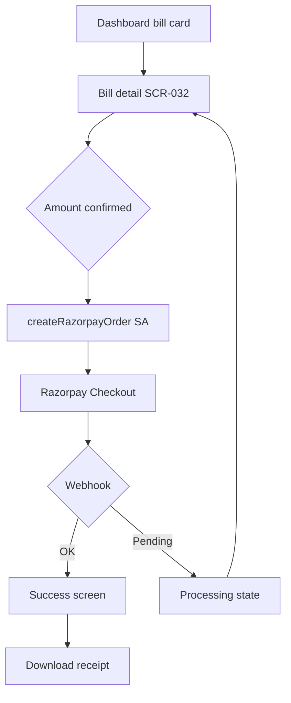

| Step | Permission | Notes |
| --- | --- | --- |
| View bill | Resident RLS | Own house only |
| Pay | `requireResident` | Creates `payments` row `pending` |
| Confirm | Webhook service role | Resident UI polls/waits |

**Cash path:** Resident pays at office → no app action; Office records on `/office/payments`.

---

## 39. Receipt Download Flow

**Status:** 🔜 Phase 4.

| Step | Actor | Flow |
| --- | --- | --- |
| 1 | System | On payment success → insert `receipts` + `receipt_data` JSONB |
| 2 | Resident | `/resident/payments` history list |
| 3 | Tap receipt | `/resident/payments/[id]` or download route |
| 4 | — | Server generates PDF from JSONB (@react-pdf/renderer) |
| 5 | — | Browser download or share sheet (mobile) |

**Re-download:** Same route anytime — receipts immutable.

**Admin:** Same data from `/admin/payments` with house filter (Phase 4).

---

## 40. Future Expansion Navigation Strategy

| Feature | Nav impact |
| --- | --- |
| Multi-society super admin | New prefix `/platform` + society switcher in header |
| Chairman audit log | Settings sub-link or `/admin/audit` |
| Hindi i18n | Route structure unchanged; copy via `next-intl` |
| WhatsApp deep links | `/resident/bills?month=` public only after auth |
| Polls / voting | New resident tab or under Notices |
| IoT water readings | Office water screen auto-fill units |

**Constraint:** Preserve role prefixes; never merge admin and resident nav trees.

---

## Appendix A — Master Navigation Diagram

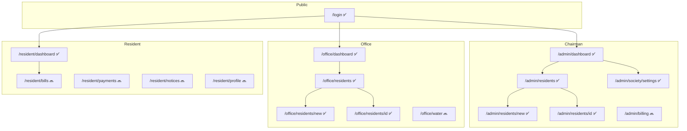

---

## Appendix B — Phase 2 Screen Transition Table

| From | Action | To | Role |
| --- | --- | --- | --- |
| `/admin/residents` | Tap Add House | `/admin/residents/new` | Chairman |
| `/admin/residents/new` | Submit create | `/admin/residents/{id}` | Chairman |
| `/admin/residents` | Tap card | `/admin/residents/{id}` | Chairman |
| `/admin/residents/{id}` | ← Residents | `/admin/residents` | Chairman |
| `/admin/society/settings` | Save settings | Same (success banner) | Chairman |
| `/office/residents` | Tap Add House | `/office/residents/new` | Office |
| `/office/residents/new` | Submit | `/office/residents/{id}` | Office |
| Any admin list | Search submit | Same URL + `?q=` | Chairman |

---

## Appendix C — AI Agent UX Checklist

When building Phases 3–6 screens:

1. **Match role prefix** — never link residents to `/admin`
2. **Use `PageHeader` + `EmptyState` + `AlertBanner`** for consistency
3. **Prefer URL filters** over client-only state for list views
4. **Card lists on mobile** — no wide tables
5. **Mark sidebar items** `soon: true` until route exists
6. **Add `loading.tsx`** for heavy list routes
7. **Honor `redirectBase`** when reusing `HouseForm` for office
8. **Payment UI** must show processing until server confirms
9. **Update this document** when adding routes — keep Appendix A in sync

---

## Appendix D — Implemented vs Planned Route Summary

| Route | Phase | Status |
| --- | --- | --- |
| `/login` | 1 | ✅ |
| `/admin/dashboard` | 1 | ✅ placeholder |
| `/admin/residents` (+ new, [id]) | 2 | ✅ |
| `/admin/society/settings` | 2 | ✅ |
| `/office/dashboard` | 1 | ✅ placeholder |
| `/office/residents` (+ new, [id]) | 2 | ✅ |
| `/resident/dashboard` | 1 | ✅ placeholder |
| `/resident/bills` | 3 | 🔜 |
| `/office/water` | 3 | 🔜 |
| `/admin/billing`, `/office/billing` | 3 | 🔜 |
| `/admin/payments`, `/office/payments` | 4 | 🔜 |
| `/resident/payments`, receipts | 4 | 🔜 |
| `/admin/notices`, `/resident/notices` | 6 | 🔜 |

---

*End of App Flow & User Navigation Document v1.0.0*
