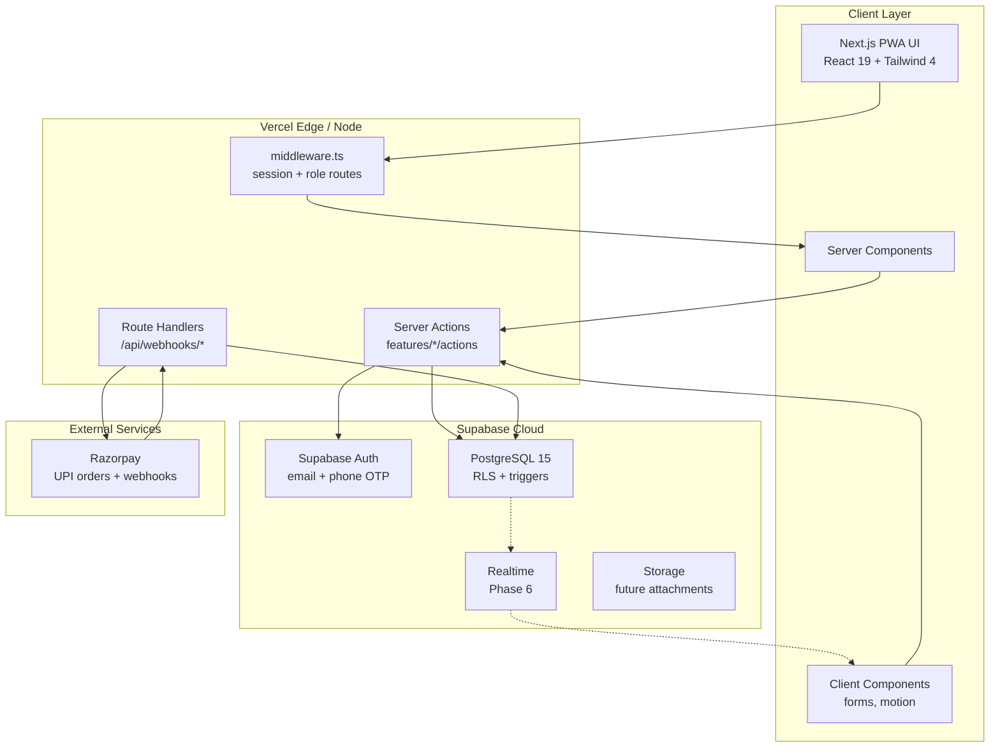
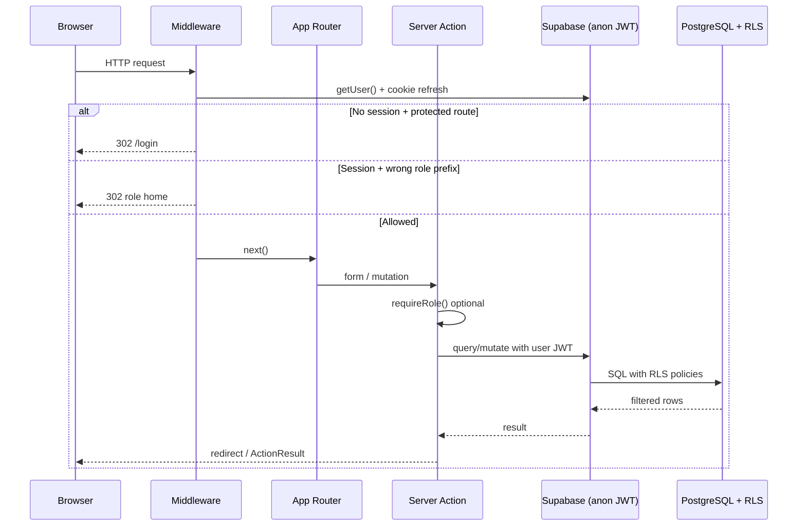
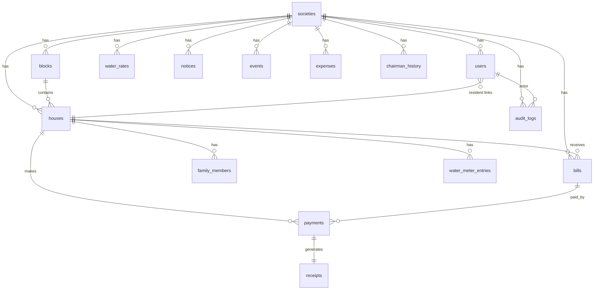
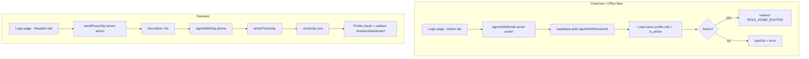
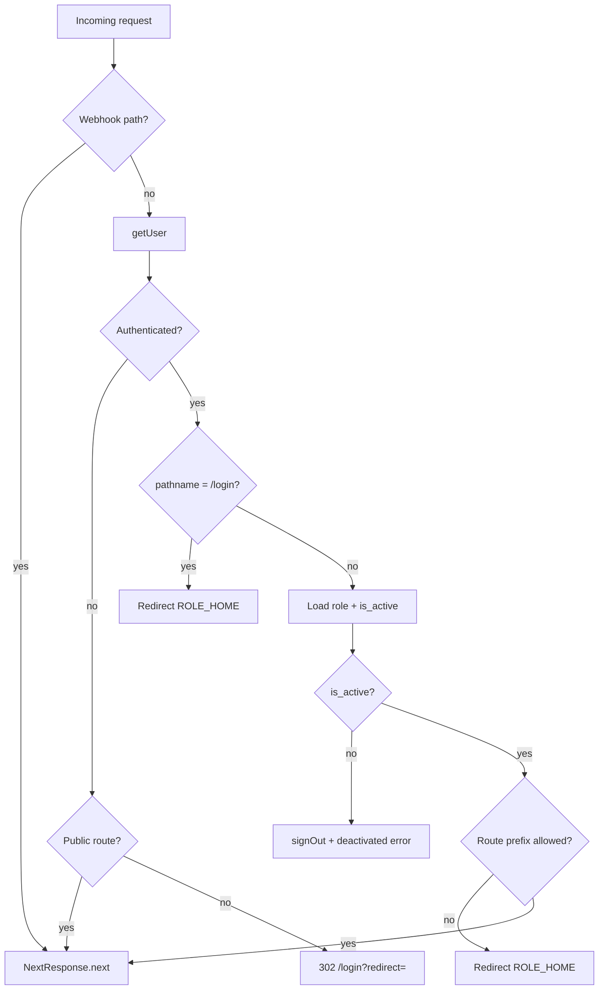
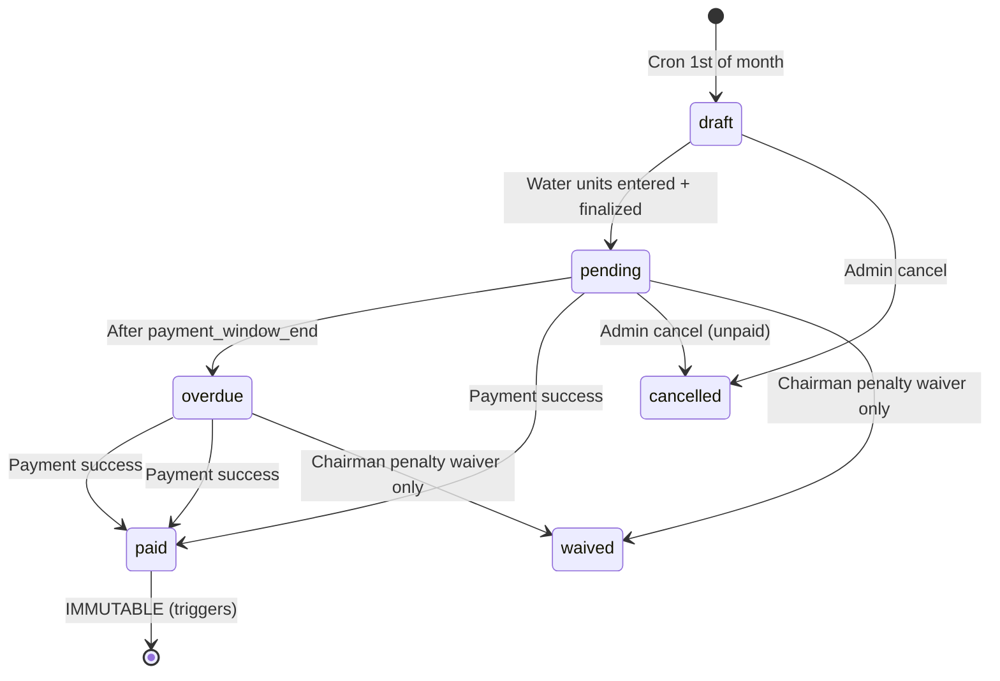
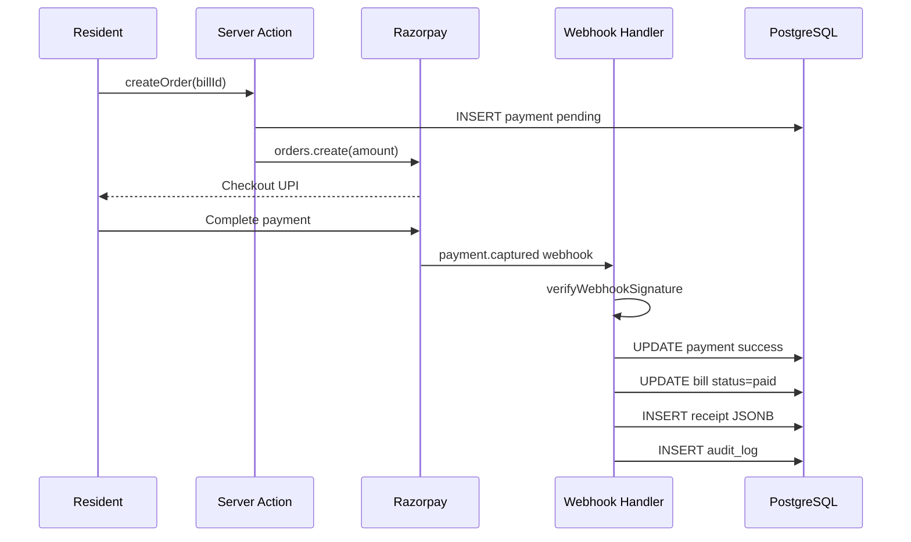
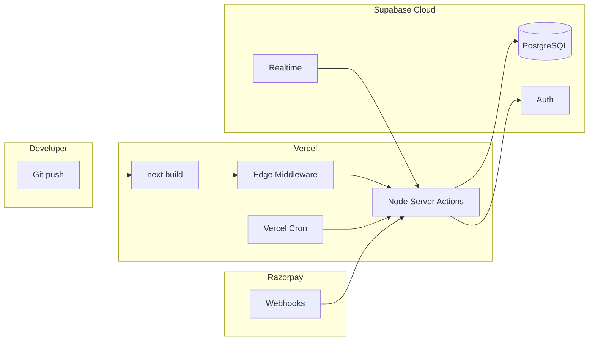
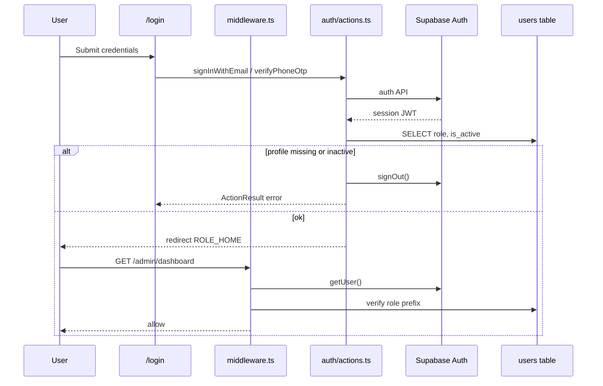
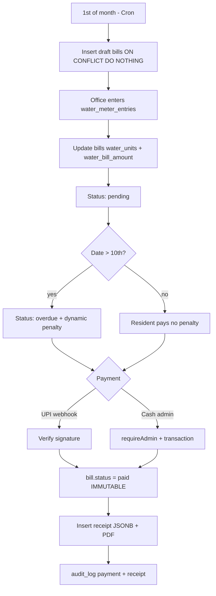

# Technical Requirements Document (TRD)

## Society Maintenance & Water Billing Management System

| Field | Value |
| --- | --- |
| **Document version** | 1.0.0 |
| **Status** | Phase 1 complete — Phases 2–6 planned |
| **Reference PRD** | Society Maintenance & Water Billing PRD (source of truth for product) |
| **Reference implementation** | Phase 1 Foundation Architecture Report |
| **Primary demo tenant** | Shyamved Residency, Naroda, Ahmedabad |
| **Repository path** | `D:\SHYAMVED AUTOMATE\society-management` |
| **Audience** | Engineering, AI coding agents (Cursor, Antigravity, Claude Code, Windsurf), future contributors |

---

## Document Control

This TRD documents **implemented** Phase 1 architecture and **specified** Phase 2–6 technical designs aligned with the PRD. Sections marked **(Implemented)** reflect code and migrations in the repository today. Sections marked **(Planned)** describe approved designs not yet built.

---

## 1. Executive Summary

### 1.1 Purpose

The Society Maintenance & Water Billing Management System is a **production-grade, mobile-first, multi-tenant-ready SaaS** for Indian residential societies. It digitizes maintenance billing, water consumption billing, payments (UPI + cash), receipts, resident records, notices, events, and administrative oversight.

### 1.2 Phase 1 delivery summary (Implemented)

Phase 1 established a secure foundation:

- **Next.js 16** App Router application with TypeScript, Tailwind CSS 4, and feature-based structure
- **Supabase** PostgreSQL schema (15 tables), **RLS** (35+ policies), and **immutable financial triggers**
- **Dual-layer security**: Next.js middleware (route/role) + Supabase RLS (data)
- **Authentication** via server actions: email/password (admins), phone OTP (residents)
- **Razorpay scaffolding** (client singleton, HMAC verification utilities) — activation via env only
- **Design system** (glassmorphism tokens, role layouts, login UI)
- **Seed data** for Shyamved Residency

### 1.3 Architectural principles

| Principle | Implementation |
| --- | --- |
| Billing integrity | `UNIQUE(house_id, billing_month)`; paid-bill DB triggers; receipt JSONB snapshots |
| Payment integrity | Server-only Razorpay verification; webhook idempotency (planned); no client-trusted success |
| Security depth | Middleware → server action `requireRole` → RLS → triggers |
| Multi-tenant readiness | `society_id` on all society-owned tables |
| Mobile-first | Resident bottom nav; admin responsive sidebar; card layouts over tables |
| Maintainability | Feature folders; centralized `types/`; planned `lib/billing` single source of truth |

### 1.4 Non-goals in current codebase

- Billing engine UI/logic (Phase 3)
- Razorpay webhook route handler (Phase 4 — path reserved)
- PDF receipt generation (Phase 4)
- Resident/house CRUD screens (Phase 2)
- Supabase Realtime subscriptions (Phase 6)

---

## 2. System Architecture

### 2.1 High-level architecture



### 2.2 Request lifecycle (Implemented)



### 2.3 Security layers (defense in depth)

| Layer | Location | Responsibility |
| --- | --- | --- |
| L1 | `src/middleware.ts` | Session refresh; public vs protected routes; role prefix enforcement; deactivated account sign-out |
| L2 | `src/lib/auth/utils.ts` | `requireAuth`, `requireRole`, `requireChairman`, `requireAdmin`, `requireResident` in server actions |
| L3 | `src/types/roles.ts` | Permission helpers (`canWaivePenalty`, etc.) — UX hints only; not security |
| L4 | `supabase/migrations/003_rls_policies.sql` | Row-level isolation by `society_id` and `house_id` |
| L5 | `supabase/migrations/002_paid_bill_immutability.sql` | Immutable paid bills, successful payments, all receipts |
| L6 | Service role | Webhooks, receipt insert, audit insert — **server-only**, never exposed to browser |

**Design decision:** Middleware cannot replace RLS (JWT can be manipulated in non-browser clients). RLS cannot replace middleware (poor UX if users hit forbidden pages). Both are required.

### 2.4 Multi-tenant model (Implemented)

- Every operational table includes `society_id`.
- `users.society_id` binds authenticated identity to one society.
- RLS helper `auth_user_society_id()` scopes all policies.
- Future super-admin / multi-society dashboard will add a platform role without breaking existing policies.

---

## 3. Technology Stack

### 3.1 Implemented versions (from `package.json`)

| Technology | Version | Role |
| --- | --- | --- |
| **Next.js** | 16.2.6 | App Router, RSC, middleware, server actions |
| **React** | 19.2.4 | UI runtime |
| **TypeScript** | ^5 | End-to-end typing |
| **Tailwind CSS** | ^4 | Utility styling + `@import "tailwindcss"` |
| **Supabase JS** | ^2.106 | Database + auth |
| **@supabase/ssr** | ^0.10.3 | Cookie-bound server/browser clients |
| **Zod** | ^4.4 | Input validation (phases 2+) |
| **react-hook-form** | ^7.76 | Forms |
| **date-fns** | ^4.3 | Billing dates, penalty day math |
| **Framer Motion** | ^12.40 | Phase 6 animations |
| **Razorpay SDK** | ^2.9.6 | Server order creation (Phase 4) |
| **@react-pdf/renderer** | ^4.5.1 | Server PDF receipts (Phase 4) |
| **Zustand** | ^5.0.13 | Light client state (Phase 6) |
| **lucide-react** | ^1.16 | Icons |
| **Supabase CLI** | ^2.101 (dev) | Migrations, `db:types`, local stack |

**Note:** PRD references Next.js 15; the scaffolded project uses **Next.js 16.2.6**. All TRD references use the implemented version.

### 3.2 Infrastructure (Planned deployment)

| Service | Purpose |
| --- | --- |
| **Vercel** | Hosting, SSR, edge middleware, cron for bill generation |
| **Supabase Cloud** | Managed Postgres, Auth, Realtime, optional Storage |
| **Razorpay** | UPI payment gateway (India) |

### 3.3 Deliberate exclusions (MVP)

- Separate microservices
- Custom auth server (Supabase Auth is system of record)
- Client-side payment confirmation as source of truth
- SMS/WhatsApp notifications
- Native mobile apps

---

## 4. Frontend Architecture

### 4.1 App Router structure (Implemented)

```
src/app/
├── layout.tsx              # Root layout, fonts, globals
├── page.tsx                # Redirect to /login
├── globals.css             # Design tokens + glass utilities
├── login/page.tsx          # Client login (email + phone OTP)
├── auth/callback/route.ts  # Supabase OAuth/redirect handler
├── admin/
│   ├── layout.tsx          # Chairman sidebar shell
│   └── dashboard/page.tsx  # Placeholder dashboard
├── office/
│   ├── layout.tsx          # Office Man sidebar shell
│   └── dashboard/page.tsx
├── resident/
│   ├── layout.tsx          # Bottom navigation shell
│   └── dashboard/page.tsx
└── api/webhooks/           # (Planned) razorpay/route.ts
```

### 4.2 Rendering strategy

| Pattern | Use case |
| --- | --- |
| **Server Components** | Dashboard shells, data lists, initial page data (phases 2+) |
| **Client Components** | Login form, OTP steps, Razorpay checkout button, Framer Motion |
| **Server Actions** | All mutations: auth, billing, payments, CRUD |
| **Route Handlers** | Razorpay webhooks only (raw body for signature verification) |

**Tradeoff:** Server Actions simplify auth (cookies automatic) vs REST APIs. Webhooks remain Route Handlers because they require raw body and service-role client.

### 4.3 Role-based UI shells (Implemented)

| Role | Layout | Navigation |
| --- | --- | --- |
| Chairman | `admin/layout.tsx` | Sidebar (desktop), collapsible (mobile) |
| Office Man | `office/layout.tsx` | Same admin pattern |
| Resident | `resident/layout.tsx` | Fixed bottom nav (thumb zone) |

### 4.4 Import alias

- `@/*` → `src/*` (configured at scaffold time)

---

## 5. Backend Architecture

### 5.1 Backend model: Supabase + Next.js server tier

There is **no separate Node API service**. The Next.js server tier is the application backend:

- **Server Actions** (`'use server'`) — primary mutation and auth path
- **Route Handlers** — webhooks and future cron endpoints
- **PostgreSQL** — business rules, constraints, RLS, triggers

### 5.2 Execution contexts

| Context | Supabase client | RLS |
| --- | --- | --- |
| Browser | `createBrowserClient` (`lib/supabase/client.ts`) | Enforced |
| Server Component / Action | `createSupabaseServerClient()` | Enforced |
| Middleware | Inline `createServerClient` with request cookies | Enforced |
| Webhook / cron | `createSupabaseServiceClient()` | **Bypassed** |

### 5.3 Planned feature modules (Phases 2–6)

```
src/features/
├── auth/actions.ts          ✅ Implemented
├── society/                 Phase 2
├── residents/               Phase 2
├── billing/                 Phase 3
├── payments/                Phase 4
├── receipts/                Phase 4
├── expenses/                Phase 5
├── notices/                 Phase 6
├── events/                  Phase 6
└── dashboard/               Phase 5
```

Each feature owns:

- `actions.ts` — server actions with `requireRole`
- `queries.ts` — typed Supabase reads (optional split)
- `schemas.ts` — Zod validation
- `types.ts` — feature-specific types if needed

---

## 6. Database Architecture

### 6.1 Entity relationship (Implemented)



### 6.2 Migration strategy (Implemented)

| File | Purpose |
| --- | --- |
| `001_initial_schema.sql` | Tables, enums, indexes, `updated_at` triggers, audit immutability rules |
| `002_paid_bill_immutability.sql` | Financial immutability triggers |
| `003_rls_policies.sql` | RLS enablement, helper functions, 35+ policies |
| `seed.sql` | Shyamved Residency demo data |

**Commands** (`package.json`):

- `npm run db:push` — push migrations to linked project
- `npm run db:reset` — local reset with seed
- `npm run db:types` — generate `database-generated.ts` from local Supabase

### 6.3 Critical constraints (Implemented)

| Rule | Enforcement |
| --- | --- |
| One bill per house per month | `UNIQUE (house_id, billing_month)` on `bills` |
| One active chairman per society | Partial unique index on `chairman_history` WHERE `status = 'active'` |
| One active water rate per society | Partial unique index on `water_rates` WHERE `effective_to IS NULL` |
| One water entry per house per month | `UNIQUE (house_id, billing_month)` on `water_meter_entries` |
| Unique Razorpay IDs | `UNIQUE` on `razorpay_order_id`, `razorpay_payment_id` |
| Unique receipt numbers | `UNIQUE` on `receipt_number` |
| Audit logs append-only | PostgreSQL `RULE` blocks UPDATE/DELETE on `audit_logs` |

---

## 7. PostgreSQL Schema Design

### 7.1 Table inventory (15 tables — Implemented)

| Table | Primary purpose |
| --- | --- |
| `societies` | Billing config: maintenance ₹, payment window, penalty/day |
| `blocks` | Wings A, B, C |
| `houses` | Flat records, owner/tenant, primary contact |
| `family_members` | Multiple members; one `is_primary_contact` per house (app-enforced) |
| `users` | Profile extending `auth.users`: role, society_id, house_id |
| `chairman_history` | Chairman transitions |
| `water_rates` | Historical ₹/unit with `effective_from` / `effective_to` |
| `water_meter_entries` | Monthly units + price snapshot at entry |
| `bills` | Monthly bill financial snapshot fields |
| `payments` | UPI + cash records |
| `receipts` | Immutable `receipt_data` JSONB + optional `pdf_url` |
| `expenses` | Society expenses |
| `notices` | Audience, priority, block targeting |
| `events` | Society calendar |
| `audit_logs` | Append-only audit trail |

### 7.2 Enum types (Implemented)

`user_role`, `occupancy_status`, `bill_status`, `payment_mode`, `payment_status`, `notice_type`, `notice_priority`, `notice_audience`, `notice_status`, `event_type`, `event_status`, `chairman_status`, `audit_action`.

### 7.3 Bills table — financial snapshot design

**Stored on bill (snapshot at generation/update):**

- `maintenance_amount`, `water_units`, `water_unit_price`, `water_bill_amount`
- Penalty waiver metadata: `penalty_waived`, `penalty_waived_by`, `penalty_waiver_reason`, `penalty_waived_at`

**Not stored as columns (by design):**

- `penalty_amount` — computed dynamically until payment (PRD §7.3)
- `final_payable` — computed at read time and frozen into `receipts.receipt_data` on payment

**Rationale:** Late penalty grows daily; storing a stale penalty on the row would cause billing errors. Receipt JSONB captures the exact paid breakdown.

### 7.4 Society billing configuration (Implemented defaults)

| Field | Default | Source |
| --- | --- | --- |
| `maintenance_amount` | 850.00 | `societies` column default |
| `payment_window_start` | 1 | day of month |
| `payment_window_end` | 10 | day of month |
| `penalty_per_day` | 10.00 | ₹ per day after window |

Seed society **Shyamved Residency** uses these defaults unless overridden in settings UI (Phase 2).

---

## 8. Supabase Architecture

### 8.1 Project layout (Implemented)

```
supabase/
├── config.toml
├── migrations/
│   ├── 001_initial_schema.sql
│   ├── 002_paid_bill_immutability.sql
│   └── 003_rls_policies.sql
└── seed.sql
```

### 8.2 Auth integration

- `users.id` → `UUID PRIMARY KEY REFERENCES auth.users(id) ON DELETE CASCADE`
- Profile created by admin onboarding (Phase 2) or seed scripts
- Phone OTP uses Supabase Auth SMS provider (configured in Supabase dashboard)

### 8.3 Client modules (Implemented)

**`src/lib/supabase/client.ts`** — Browser client (`createBrowserClient`)

**`src/lib/supabase/server.ts`:**

- `createSupabaseServerClient()` — cookie store from `next/headers`
- `createSupabaseServiceClient()` — service role, no session persistence

**`src/lib/supabase/middleware.ts`** — session refresh helper (available; primary logic in root `middleware.ts`)

### 8.4 Service role usage policy (Planned operations)

| Operation | Why service role |
| --- | --- |
| Razorpay webhook bill/payment update | No user JWT; must be idempotent |
| Receipt insert after payment | Residents have SELECT-only on receipts |
| Audit log insert | Chairman SELECT-only; inserts from trusted server |
| Monthly cron bill generation | System actor, not end user |

**Never** import `createSupabaseServiceClient` in client bundles.

---

## 9. Authentication System

### 9.1 Auth flows (Implemented)



### 9.2 Implementation details (Implemented)

| Aspect | Decision |
| --- | --- |
| Mutation location | `src/features/auth/actions.ts` — **no direct Supabase auth from browser** |
| Phone normalization | `+91` prefix; strip leading `0` |
| Post-login routing | `ROLE_HOME_ROUTES` in `types/roles.ts` |
| Deactivated users | `is_active = false` → `signOut()` + error message |
| Sign out | `signOut()` + `revalidatePath` + redirect `/login` |
| Callback | `src/app/auth/callback/route.ts` for Supabase redirect flows |

### 9.3 Session management (Implemented)

- Middleware calls `supabase.auth.getUser()` on every matched request (session refresh)
- Cookie bridging via `@supabase/ssr` `setAll` on response
- **Rule:** No logic between `createServerClient` and `getUser()` in middleware (documented in code)

### 9.4 Future auth (Planned)

- Admin-provisioned resident accounts (optional PRD)
- Magic link for admins
- Multi-society user accounts (single auth user, multiple `user_roles` — not in schema yet)

---

## 10. Authorization & Role-Based Access Control

### 10.1 Roles (Implemented)

| Role | DB enum | Route prefix | Home |
| --- | --- | --- | --- |
| Chairman | `chairman` | `/admin/*` | `/admin/dashboard` |
| Office Man | `office_man` | `/office/*` | `/office/dashboard` |
| Resident | `resident` | `/resident/*` | `/resident/dashboard` |

### 10.2 Permission matrix (PRD + `types/roles.ts`)

| Capability | Chairman | Office Man | Resident |
| --- | :---: | :---: | :---: |
| Society settings | ✅ | ❌ | ❌ |
| Manage residents/houses | ✅ | ✅ | ❌ |
| Water unit entry | ✅ | ✅ | ❌ |
| Generate/edit unpaid bills | ✅ | ✅ | ❌ |
| Edit paid bills | ❌ | ❌ | ❌ |
| Waive penalty | ✅ | ❌ | ❌ |
| Record cash payment | ✅ | ✅ | ❌ |
| Pay UPI (Razorpay) | ❌ | ❌ | ✅ |
| View own bills/receipts | ✅ | ✅ | ✅ |
| Expenses | ✅ | ✅ | ❌ |
| Notices/events CRUD | ✅ | ✅* | read published |
| Chairman history | ✅ | read | ❌ |
| Analytics | ✅ | limited | ❌ |

\*Office Man notice/event creation per society policy (same admin RLS).

### 10.3 Server-side enforcement (Implemented)

```typescript
// src/lib/auth/utils.ts
requireAuth()
requireRole(['chairman', 'office_man'])
requireChairman()
requireAdmin()
requireResident()
```

**Pattern for all server actions (Phases 2+):**

1. `const profile = await requireAdmin()` (or appropriate role)
2. Validate input with Zod
3. Perform Supabase mutation (RLS double-check)
4. Write `audit_logs` via service client
5. Return `ActionResult<T>` or `redirect()`

---

## 11. Row Level Security Strategy

### 11.1 Helper functions (Implemented — `SECURITY DEFINER STABLE`)

| Function | Returns |
| --- | --- |
| `auth_user_society_id()` | Current user's `society_id` |
| `auth_user_role()` | `user_role` enum |
| `auth_user_house_id()` | Resident's `house_id` |
| `auth_user_is_admin()` | `chairman` or `office_man` |
| `auth_user_is_chairman()` | `chairman` only |

### 11.2 Policy patterns (Implemented)

**Residents:**

- SELECT own `houses`, `bills`, `payments`, `receipts` via `house_id = auth_user_house_id()`
- SELECT published `notices` / `events` in their society
- INSERT `payments` only when `payment_mode = 'upi'` AND `status = 'pending'` (initiation)

**Admins (chairman + office_man):**

- Full SELECT/INSERT/UPDATE on operational tables within `society_id`
- DELETE restricted (e.g. blocks/houses/expenses: chairman only)

**Chairman-only:**

- `societies` UPDATE
- `water_rates` INSERT/UPDATE
- `chairman_history` INSERT/UPDATE
- `audit_logs` SELECT
- Several DELETE policies

### 11.3 Intentional RLS gaps (handled server-side)

| Operation | Why not user RLS |
| --- | --- |
| Payment success update | Webhook uses service role |
| Receipt INSERT | No INSERT policy for users — service role only |
| Audit INSERT | No INSERT policy — service role only |

### 11.4 Cross-society isolation

Every policy includes `society_id = auth_user_society_id()` (or equivalent via house join). **No** policy allows reading another society's rows.

---

## 12. Middleware Architecture

### 12.1 File: `src/middleware.ts` (Implemented)

**Matcher:** All routes except `_next/static`, `_next/image`, `favicon.ico`, and static image/font extensions.

**Public routes:**

- `/login`
- `/auth/callback`
- `/api/webhooks` (signature-verified separately)

**Webhook bypass:** `/api/webhooks/*` returns `NextResponse.next()` without auth.

### 12.2 Decision flow



### 12.3 Tradeoffs

| Choice | Benefit | Cost |
| --- | --- | --- |
| DB hit per protected request | Accurate role routing | Extra latency — acceptable for MVP |
| Prefix-based routes | Simple mental model | New roles need middleware update |
| No RLS in middleware | Clear separation | Must not assume middleware is sufficient |

---

## 13. Billing Engine Technical Design

### 13.1 Status: **Planned (Phase 3)** — schema and rules ready

Central module: **`src/lib/billing/`** (to be created)

```
src/lib/billing/
├── calculate.ts      # Pure functions — penalty, totals
├── generate.ts       # Idempotent monthly generation
├── status.ts         # State machine transitions
├── water.ts          # Unit price resolution for month
└── types.ts
```

### 13.2 Billing formula (single source of truth)

```typescript
// Pseudocode — must match PRD exactly
function calculatePenalty(
  billingMonth: Date,
  paymentWindowEnd: number,  // default 10
  penaltyPerDay: number,     // default 10
  penaltyWaived: boolean,
  asOf: Date = new Date()
): number {
  if (penaltyWaived) return 0
  const dueEnd = endOfDay(billingMonth, paymentWindowEnd)
  if (asOf <= dueEnd) return 0
  const lateDays = differenceInCalendarDays(asOf, dueEnd)
  return Math.max(0, lateDays) * penaltyPerDay
}

function calculateBillTotal(bill: Bill, society: Society, asOf?: Date): number {
  const maintenance = bill.maintenance_amount
  const water = bill.water_bill_amount ?? 0
  const penalty = calculatePenalty(/* ... */)
  return maintenance + water + penalty
}
```

**Rules:**

- Penalty is **never persisted** on `bills` row (only waiver flags)
- `water_unit_price` on bill is snapshot at bill finalization
- `water_meter_entries.unit_price` snapshots rate at entry time

### 13.3 Bill state machine (Planned)



| Status | Editable fields (admin) |
| --- | --- |
| `draft` | All except after paid |
| `pending` / `overdue` | Water units, amounts, status — not if transitioning to paid |
| `paid` | **None** (DB trigger) |
| `cancelled` | No payment allowed |

### 13.4 Monthly bill generation (Planned — idempotent cron)

**Trigger:** Vercel Cron `0 0 1 * *` (IST consideration: store UTC, display IST)

**Algorithm:**

```
FOR each active house IN society:
  INSERT INTO bills (
    society_id, house_id, billing_month,
    maintenance_amount, status='draft',
    water_unit_price = active_rate_for_month
  )
  ON CONFLICT (house_id, billing_month) DO NOTHING
```

**Idempotency:** `ON CONFLICT DO NOTHING` + unique constraint.

**Audit:** `audit_action = 'bill_generated'`.

### 13.5 Water unit entry flow (Planned)

1. Office Man selects billing month + house
2. Insert/upsert `water_meter_entries` with `units_consumed`, `unit_price` snapshot
3. Update linked `bills` row: `water_units`, `water_bill_amount = units × unit_price`
4. Transition `draft` → `pending` when society billing run complete

### 13.6 Penalty waiver (Planned — Chairman only)

- One-time waiver per bill: set `penalty_waived = true` with reason + `penalty_waived_by` + timestamp
- Only when bill status is `pending` or `overdue` (not `paid`)
- Audit: `penalty_waived`
- Application logic sets penalty to 0 in `calculatePenalty`

---

## 14. Payment System Architecture

### 14.1 Payment modes (schema ready)

| Mode | Initiator | Status flow |
| --- | --- | --- |
| `upi` | Resident | `pending` → `success` / `failed` |
| `cash` | Admin server action | immediate `success` |

### 14.2 Payment integrity rules (Planned)

1. **Never** mark bill `paid` from client callback alone
2. **Always** verify Razorpay signature server-side
3. **Idempotent** webhook: check `razorpay_payment_id` uniqueness
4. **Cash:** verify bill not already `paid` in transaction
5. **Amount:** payment amount must equal computed bill total at payment time
6. **Receipt:** insert `receipts` in same logical transaction as bill `paid` update

### 14.3 Payment state diagram (Planned)



---

## 15. Razorpay Integration Design

### 15.1 Implemented scaffolding

| File | Status |
| --- | --- |
| `src/lib/razorpay/client.ts` | Singleton + `isRazorpayConfigured()` |
| `src/lib/razorpay/verify.ts` | `verifyPaymentSignature`, `verifyWebhookSignature` with `timingSafeEqual` |

### 15.2 Environment variables

```
NEXT_PUBLIC_RAZORPAY_KEY_ID=     # Checkout UI only
RAZORPAY_KEY_SECRET=             # Server only
RAZORPAY_WEBHOOK_SECRET=         # Webhook HMAC
```

### 15.3 Planned endpoints

| Endpoint | Method | Auth |
| --- | --- | --- |
| `features/payments/actions.ts` → `createRazorpayOrder` | Server Action | `requireResident` |
| `src/app/api/webhooks/razorpay/route.ts` | POST | Webhook signature |

### 15.4 Webhook handler requirements (Planned)

1. Read **raw body** (do not parse JSON before verify)
2. `verifyWebhookSignature({ rawBody, signature })`
3. Handle `payment.captured` (and idempotent ignore duplicates)
4. Use `createSupabaseServiceClient()`
5. Match order to `payments.razorpay_order_id`
6. Update atomically: payment → bill → receipt → audit

### 15.5 Security controls

- Placeholder detection in verify functions (throws if keys contain `placeholder`)
- No `RAZORPAY_KEY_SECRET` in `NEXT_PUBLIC_*`
- Middleware allows unauthenticated webhook path; **signature is the auth**

---

## 16. Receipt Generation System

### 16.1 Status: **Planned (Phase 4)** — table ready

**Table:** `receipts`

- `receipt_data JSONB NOT NULL` — immutable snapshot
- `pdf_url TEXT` — optional Supabase Storage URL
- `payment_id UNIQUE` — one receipt per payment
- **Deletion blocked** by `prevent_receipt_deletion` trigger

### 16.2 Receipt JSONB schema (Planned)

```typescript
interface ReceiptSnapshot {
  society_name: string
  society_address: string
  receipt_number: string
  house_number: string
  primary_contact_name: string
  billing_month: string
  maintenance_amount: number
  water_units: number
  water_unit_price: number
  water_bill_amount: number
  late_penalty: number
  total_paid: number
  payment_mode: 'upi' | 'cash'
  paid_at: string
  authorized_footer: string
}
```

### 16.3 PDF pipeline (Planned)

- **Library:** `@react-pdf/renderer` (already installed)
- **Generation location:** Server Action or webhook handler (Node runtime)
- **Storage:** Supabase Storage bucket `receipts/{society_id}/{receipt_number}.pdf` (optional MVP: on-demand generate without storage)
- **Resident access:** SELECT via RLS on `receipts`; download route returns PDF stream

**Rule:** PDF content must match `receipt_data` JSONB exactly.

---

## 17. Audit Logging System

### 17.1 Table (Implemented)

`audit_logs`: `actor_id`, `actor_role`, `action_type` (enum), `entity_type`, `entity_id`, `previous_value`, `new_value`, `created_at`.

**Immutability:**

- `RULE no_update_audit_logs` → UPDATE does nothing
- `RULE no_delete_audit_logs` → DELETE does nothing

### 17.2 Insert path (Planned)

Server actions call internal `writeAuditLog()` using **service role**:

```typescript
async function writeAuditLog(params: {
  societyId: string
  actorId: string
  actorRole: UserRole
  actionType: AuditActionType
  entityType: string
  entityId?: string
  previousValue?: Json
  newValue?: Json
})
```

### 17.3 RLS (Implemented)

- SELECT: Chairman only (`audit_logs_select_chairman`)
- INSERT: Service role only (no user INSERT policy)

### 17.4 Actions requiring audit (PRD + enum)

Bill generation/update, water entry, payments, penalty waiver, resident CRUD, chairman change, notice/event publish, expense create, settings update.

---

## 18. Realtime Architecture

### 18.1 Status: **Planned (Phase 6)**

### 18.2 MVP channels (Planned)

| Channel | Table | Event | Consumer |
| --- | --- | --- | --- |
| Resident bill | `bills` | UPDATE status | Resident dashboard |
| Admin metrics | `payments` | INSERT | Chairman/Office dashboards |
| Notices | `notices` | INSERT/UPDATE published | Resident home |

### 18.3 Design rules

1. **Database is source of truth** — Realtime is UX enhancement only
2. After payment, resident UI waits for webhook-confirmed state (or polling fallback)
3. Subscribe with filtered `house_id` / `society_id` — never global subscriptions
4. Unsubscribe on route leave (prevent memory leaks)

### 18.4 Client pattern (Planned)

```typescript
// Client component only
const supabase = createBrowserClient()
supabase
  .channel(`bill:${billId}`)
  .on('postgres_changes', { event: 'UPDATE', schema: 'public', table: 'bills', filter: `id=eq.${billId}` }, handler)
  .subscribe()
```

---

## 19. API & Server Actions Strategy

### 19.1 Primary pattern: Server Actions (Implemented for auth)

**Return type:**

```typescript
type ActionResult<T = void> =
  | { success: true; data: T }
  | { success: false; error: string }
```

**Conventions (Phases 2+):**

- File-level `'use server'`
- First lines: `requireRole` / `requireChairman`
- Zod parse `FormData` or typed arguments
- `revalidatePath` / `revalidateTag` after mutations
- User-facing errors sanitized; log full error server-side

### 19.2 Route Handlers — restricted use

| Route | Purpose |
| --- | --- |
| `auth/callback/route.ts` | ✅ Supabase auth exchange |
| `api/webhooks/razorpay/route.ts` | ⏳ Payment webhooks |
| `api/cron/generate-bills/route.ts` | ⏳ Secured with `CRON_SECRET` |

### 19.3 No public REST CRUD

External integrations (future) may add `/api/v1` with API keys — out of MVP scope.

---

## 20. State Management Strategy

### 20.1 Server state (primary)

- **React Server Components** fetch initial data
- **Server Actions** mutate + `revalidatePath`
- **Supabase session** in cookies — no manual JWT storage

### 20.2 Client state (minimal)

| Tool | Use case |
| --- | --- |
| **React `useState`** | Login OTP step, modals, form wizard |
| **Zustand** (installed) | Optional: resident bottom nav badge counts (Phase 6) |
| **URL search params** | Admin filters (month, block, payment status) |

### 20.3 Anti-patterns

- Duplicating bill totals in global client store
- Caching payment success without server confirmation
- Storing service role or Razorpay secret in Zustand

---

## 21. File Storage Architecture

### 21.1 Status: **Future / Phase 4+**

| Bucket | Content | Access |
| --- | --- | --- |
| `receipts` | PDF files | Signed URL or RLS-scoped path |
| `expenses` | Attachment images | Admin-only (future) |

**MVP:** Receipt PDFs may be generated on-demand from `receipt_data` without Storage upload.

---

## 22. Mobile-First UI Architecture

### 22.1 Layout rules (Implemented shells)

- **Residents:** bottom navigation, single-column cards, `100dvh` min height
- **Admins:** sidebar collapses on mobile; operational tables become card lists
- Touch targets ≥ 44px; primary CTAs in thumb zone

### 22.2 Performance

- Lazy load heavy admin routes (`dynamic(() => import(...), { ssr: false })` where needed)
- Skeleton classes in `globals.css` (`.skeleton`)
- Avoid large data tables on `<640px`

### 22.3 PWA (Phase 6)

- `manifest.json`, icons in `public/`
- Service worker optional (network-first for financial data)

---

## 23. Design System & Glassmorphism Tokens

### 23.1 Implemented: `src/app/globals.css`

**CSS variables (`:root`):**

| Token | Value / purpose |
| --- | --- |
| `--color-brand-primary` | Indigo 500 |
| `--color-brand-secondary` | Violet 500 |
| `--color-paid` / `pending` / `overdue` | Status semantics |
| `--glass-bg`, `--glass-border`, `--glass-blur`, `--glass-shadow` | Glass panels |
| `--page-padding-*` | Responsive spacing |
| `--radius-card`, `--radius-button` | Consistency |

**Utility classes:**

- `.glass-card`, `.glass-panel`
- `.gradient-brand`, `.gradient-page`, `.gradient-success`
- `.badge-paid`, `.badge-pending`, `.badge-overdue`
- `.btn-primary`, `.btn-secondary`, etc.
- `.input`, `.label`, `.skeleton`

### 23.2 Theme

- Dark slate base (`#0f172a` body)
- Glassmorphism over gradients — contrast checked for WCAG on status badges

### 23.3 Framer Motion (Phase 6)

- Page transitions, card entrance, payment success
- Respect `prefers-reduced-motion`
- Animate transform/opacity only (GPU-friendly)

---

## 24. Folder Structure Architecture

### 24.1 Current tree (Phase 1)

```
society-management/
├── src/
│   ├── app/                    # Routes + layouts
│   ├── features/
│   │   └── auth/actions.ts
│   ├── lib/
│   │   ├── supabase/
│   │   ├── auth/utils.ts
│   │   ├── razorpay/
│   │   └── utils.ts
│   ├── types/
│   │   ├── database.ts
│   │   └── roles.ts
│   └── middleware.ts
├── supabase/
│   ├── migrations/
│   └── seed.sql
├── public/
├── .env.example
├── SUPABASE_SETUP.md
└── TRD.md
```

### 24.2 Target tree (Phases 2–6)

```
src/
├── features/
│   ├── auth/
│   ├── society/
│   ├── residents/
│   ├── billing/
│   ├── payments/
│   ├── receipts/
│   ├── expenses/
│   ├── notices/
│   ├── events/
│   └── dashboard/
├── lib/
│   ├── billing/          # Phase 3
│   ├── pdf/              # Phase 4
│   └── audit/            # Phase 2+
├── components/           # Shared UI primitives
│   ├── ui/
│   └── layout/
```

---

## 25. Security Architecture

### 25.1 Threat model summary

| Threat | Mitigation |
| --- | --- |
| Cross-society data leak | RLS `society_id` on all tables |
| Resident accessing other houses | `house_id` policies + middleware |
| Tampering paid bills | DB triggers + no admin UI override |
| Fake payment success | Webhook HMAC + signature verify |
| Secret exposure | Server-only env vars; no secrets in client bundle |
| Privilege escalation | `users` UPDATE policy prevents self role change |
| Webhook replay | Idempotent `razorpay_payment_id` UNIQUE |

### 25.2 OWASP-aligned practices

- Input validation (Zod) on all server actions
- HTTPS only on Vercel
- `httpOnly` cookies via Supabase SSR
- Rate limiting: Supabase Auth built-in; consider Vercel WAF for webhooks

---

## 26. Environment Variable Management

### 26.1 `.env.example` (Implemented)

| Variable | Exposure | Purpose |
| --- | --- | --- |
| `NEXT_PUBLIC_SUPABASE_URL` | Public | Supabase project URL |
| `NEXT_PUBLIC_SUPABASE_ANON_KEY` | Public | Anon key (RLS enforced) |
| `SUPABASE_SERVICE_ROLE_KEY` | **Secret** | Webhooks, audit, cron |
| `NEXT_PUBLIC_RAZORPAY_KEY_ID` | Public | Checkout |
| `RAZORPAY_KEY_SECRET` | **Secret** | Orders + signature |
| `RAZORPAY_WEBHOOK_SECRET` | **Secret** | Webhook HMAC |
| `NEXT_PUBLIC_APP_URL` | Public | Redirects, Razorpay callback |
| `NEXT_PUBLIC_APP_NAME` | Public | Branding |
| `NODE_ENV` | Build | environment |

### 26.2 Planned additions

| Variable | Purpose |
| --- | --- |
| `CRON_SECRET` | Protect bill generation cron route |
| `RAZORPAY_ENABLED` | Feature flag (optional) |

### 26.3 Rules

- `.env.local` gitignored
- `.env.example` committed with empty values
- Vercel: set secrets per environment (Preview vs Production)
- Never log secrets or full webhook payloads in production

---

## 27. Error Handling Strategy

### 27.1 Server Actions

- Return `ActionResult` with user-safe `error` string
- Log internal `error.message` + stack server-side only
- Auth errors: generic "Invalid email or password" (no user enumeration)

### 27.2 Database errors

- Map `23505` unique violation → "Bill already exists for this month"
- Map trigger exceptions (`PAID BILL IS IMMUTABLE`) → user-friendly admin message

### 27.3 Webhooks (Planned)

- Invalid signature → `401` (no retry confusion)
- Processing failure → `500` (Razorpay retries)
- Already processed → `200` idempotent OK

### 27.4 Client boundaries

- `error.tsx` per route segment for admin/resident
- Global `not-found.tsx` for invalid house/bill IDs

---

## 28. Database Trigger Strategy

### 28.1 Implemented triggers

| Trigger | Table | Purpose |
| --- | --- | --- |
| `trigger_prevent_paid_bill_modification` | `bills` | Block financial field updates when `status = 'paid'` |
| `trigger_prevent_paid_bill_deletion` | `bills` | Block DELETE of paid bills |
| `trigger_prevent_payment_deletion` | `payments` | Block DELETE of `success` payments |
| `trigger_prevent_receipt_deletion` | `receipts` | Block all receipt DELETEs |
| `trigger_*_updated_at` | societies, houses, users, bills | Auto `updated_at` |

### 28.2 Application + DB redundancy

Application checks `bill.status !== 'paid'` before UPDATE; triggers enforce even if application bug or direct SQL.

### 28.3 Planned triggers (optional Phase 3+)

- `BEFORE INSERT` on `family_members` to enforce single `is_primary_contact` per house
- `BEFORE UPDATE` on `bills` to block status downgrade from `paid`

---

## 29. Immutable Financial Data Rules

### 29.1 Immutable entities (Implemented)

| Entity | Condition | Mechanism |
| --- | --- | --- |
| Paid `bills` | `status = 'paid'` | UPDATE trigger on financial columns |
| Paid `bills` | any | DELETE trigger |
| Successful `payments` | `status = 'success'` | DELETE trigger |
| All `receipts` | always | DELETE trigger |
| `audit_logs` | always | UPDATE/DELETE rules |

### 29.2 Mutable until payment

- Unpaid bill water units and amounts
- Pending UPI payment records (failed payments may be deleted — not success)

### 29.3 Correction workflow (Future)

- Admin-only adjustment entries (new table) — not MVP
- Never mutate paid bill rows

---

## 30. Performance Optimization Strategy

### 30.1 Database (Implemented indexes)

- `bills(society_id, billing_month)`, `bills(status)`, `bills(house_id)`
- `payments(society_id)`, `payments(paid_at)`
- `houses(society_id, block_id)`, `houses(is_active)`
- `audit_logs(society_id)`, `audit_logs(entity_type, entity_id)`

### 30.2 Application (Planned)

- Paginate admin house lists (50 per page)
- `revalidateTag('society-bills-2025-05')` for month-scoped cache
- Server Component parallel `Promise.all` for dashboard cards
- `@react-pdf/renderer` only on receipt route — not in main bundle

### 30.3 Network

- Target LCP < 2.5s on 4G India (PRD)
- Compress images in `public/`
- Minimize client JS on resident payment path

---

## 31. Scalability Considerations

### 31.1 Data growth

| Scale | Approach |
| --- | --- |
| 1 society, 200 houses | Current schema sufficient |
| 1 society, 2000 houses | Partition bills by `billing_month` index (already); archive old notices |
| 1000 societies SaaS | `society_id` indexing; connection pooling; read replicas via Supabase |

### 31.2 Compute

- Bill generation cron: batch INSERT per society (not per-request)
- Webhook handler: sub-200ms target; defer PDF to async job if needed

### 31.3 Future schema additions

- `organizations` above `societies`
- `user_society_roles` for multi-society admins
- Read-only analytics materialized views

---

## 32. Deployment Architecture



### 32.1 Environments

| Environment | Supabase | Razorpay |
| --- | --- | --- |
| Local | `supabase start` + seed | Test mode keys |
| Preview | Branch or staging project | Test mode |
| Production | Production project | Live mode |

### 32.2 Domain

- `NEXT_PUBLIC_APP_URL` must match Vercel production URL for auth redirects and Razorpay callbacks

---

## 33. DevOps & Environment Setup

### 33.1 Local setup (documented in `SUPABASE_SETUP.md`)

1. `npm install`
2. Copy `.env.example` → `.env.local`
3. Link Supabase project / `supabase start`
4. `npm run db:push` or `db:reset`
5. `npm run dev` → `http://localhost:3000`

### 33.2 CI/CD (Recommended)

```yaml
# .github/workflows/ci.yml (Planned)
- npm ci
- npx tsc --noEmit
- npm run lint
- npm run build
```

### 33.3 Database workflow

- Migrations committed in `supabase/migrations/`
- Never edit applied migrations — add `004_*.sql`
- Production: `supabase db push` via CI or manual reviewed deploy

---

## 34. Migration Strategy

### 34.1 Rules

1. Sequential numbered files
2. Idempotent guards only for extensions/indexes where safe
3. RLS in separate migration after tables (as implemented)
4. Triggers after tables exist

### 34.2 Phase 2+ anticipated migrations

| Migration | Content |
| --- | --- |
| `004` | `house_search` view or `tsvector` indexes |
| `005` | `notifications` table for in-app unread |
| `006` | Storage policies for receipts |
| `007` | `bill_adjustments` (future corrections) |

### 34.3 Type generation

After migration apply:

```bash
npm run db:types
```

Merge into `types/database.ts` or replace with generated file per team convention.

---

## 35. Testing & Verification Strategy

### 35.1 Phase 1 verification (Completed)

| Check | Command / method |
| --- | --- |
| TypeScript | `npx tsc --noEmit` → 0 errors |
| Dev server | `npm run dev` |
| Login render | Manual |
| Middleware | Role redirect manual test |

### 35.2 Planned test pyramid

| Layer | Focus |
| --- | --- |
| **Unit** | `lib/billing/calculate.ts` — penalty edge cases (day 10 vs 11, waiver) |
| **Integration** | Server actions with Supabase local + RLS test users |
| **E2E** | Playwright: resident pay flow (Razorpay test mode) |
| **DB** | pgTAP or SQL tests for triggers (paid bill immutability) |

### 35.3 Billing test cases (mandatory)

- Bill generation idempotency (run twice → same count)
- Penalty on 11th midnight IST boundary
- Paid bill UPDATE must fail at DB level
- Duplicate `razorpay_payment_id` rejected
- Cash payment on already-paid bill rejected
- Receipt JSONB matches paid snapshot

---

## 36. Monitoring & Logging

### 36.1 MVP

- Vercel function logs (webhook errors)
- Supabase dashboard: Auth logs, DB logs, RLS denials
- Razorpay dashboard: failed payments

### 36.2 Production recommendations

| Tool | Use |
| --- | --- |
| **Sentry** | Next.js errors, server action failures |
| **Vercel Analytics** | Web vitals |
| **Supabase Logflare** | Slow queries |
| Custom | `audit_logs` for compliance — already in schema |

### 36.3 Alerts (Planned)

- Webhook failure rate > 1%
- Bill cron did not run on 1st
- Receipt generation exceptions

---

## 37. Future Expansion Strategy

Aligned with PRD §16:

- Multi-society super admin (`organizations` + platform role)
- WhatsApp/SMS reminders (notification service)
- IoT water meters (webhook ingestion → `water_meter_entries`)
- Hindi/regional i18n (`next-intl`)
- Native apps (React Native sharing types)
- GST invoices, accounting exports
- Advanced RBAC per permission flags

**Architecture constraint:** Add features without breaking `society_id` isolation or paid bill immutability.

---

## 38. Technical Constraints

| Constraint | Source |
| --- | --- |
| One bill per house per month | PRD + DB UNIQUE |
| Paid bills immutable | PRD + triggers |
| Penalty dynamic until payment | PRD — not stored on bill row |
| No client-trusted payment | PRD + architecture |
| In-app notifications only (MVP) | PRD |
| Manual water units | PRD |
| Single primary contact per house | PRD — app validation |
| India UPI via Razorpay | PRD |
| Mobile-first | PRD + implemented layouts |

---

## 39. Known Risks & Mitigations

| Risk | Impact | Mitigation |
| --- | --- | --- |
| Webhook arrives before client redirect | Bill appears unpaid briefly | Realtime/polling; idempotent webhook |
| IST vs UTC billing month boundaries | Wrong penalty day | Store `billing_month` as DATE (1st); compute in IST utility |
| RLS misconfiguration | Data leak | Policy review checklist; integration tests per role |
| Service role misuse | Full DB bypass | Single module; code review; never import in client |
| OTP SMS cost / failure | Residents cannot login | Supabase SMS provider fallback; admin reset |
| Single society seed in dev | False sense of multi-tenant | Second society in staging seed |
| Middleware DB latency | Slow navigation | Cache role in JWT custom claim (future) |
| `@react-pdf` bundle size | Slow receipt route | Dynamic import; edge vs node runtime choice |

---

## 40. Phase-wise Development Strategy

### Phase 1 — Foundation ✅ Complete

- [x] Next.js + TypeScript + Tailwind
- [x] Supabase schema (15 tables)
- [x] RLS + helper functions
- [x] Immutability triggers
- [x] Auth server actions + middleware
- [x] Role layouts + login UI
- [x] Razorpay verify scaffolding
- [x] Seed: Shyamved Residency
- [x] Design tokens

### Phase 2 — Society & Residents (Next)

- Society settings UI
- Blocks, houses, family members CRUD
- Owner/tenant validation
- Admin search
- Water rate management
- Audit logging helper + integration

**Dependencies:** Supabase project linked, migrations applied.

### Phase 3 — Billing Engine

- `lib/billing/*` pure functions
- Water unit entry UI
- Bill generation cron
- Status lifecycle
- Chairman penalty waiver

### Phase 4 — Payments & Receipts

- Razorpay order + checkout
- Webhook route handler
- Cash payment server action
- `@react-pdf/renderer` receipts
- Payment history UI

### Phase 5 — Dashboards & Operations

- Chairman analytics
- Office operations dashboard
- Expenses module
- Reports (cash vs UPI, monthly collection)

### Phase 6 — Notices, Realtime, Polish

- Notices + events CRUD and resident feeds
- Supabase Realtime subscriptions
- Framer Motion polish
- PWA manifest + service worker
- Production Vercel deploy

---

## Appendix A — Authentication Flow Diagram



---

## Appendix B — Billing Lifecycle Diagram



---

## Appendix C — Role Route Matrix (Implemented)

```typescript
// src/middleware.ts
const ROLE_ROUTES = {
  chairman: ['/admin'],
  office_man: ['/office'],
  resident: ['/resident'],
}
const ROLE_HOME = {
  chairman: '/admin/dashboard',
  office_man: '/office/dashboard',
  resident: '/resident/dashboard',
}
```

---

## Appendix D — AI Agent Implementation Checklist

When implementing Phases 2–6, agents **must**:

1. Read PRD + this TRD before coding
2. Never duplicate billing formulas outside `lib/billing`
3. Always call `requireRole` in server actions
4. Use `createSupabaseServerClient` for user mutations; service role only for webhooks/audit/receipts
5. Respect `UNIQUE(house_id, billing_month)` — use upsert/ON CONFLICT
6. Never update paid bills — triggers will reject
7. Verify Razorpay signatures before `status = success`
8. Write audit logs for financial mutations
9. Build mobile layouts before desktop enhancements
10. Run `npx tsc --noEmit` before marking phase complete

---

## Appendix E — Seed Data Reference (Implemented)

**Society:** Shyamved Residency, Naroda, Ahmedabad

| Entity | Count |
| --- | --- |
| Blocks | 2 (A, B) |
| Houses | 8 |
| Family members | 17 |
| Water rate | ₹3.50/unit (Jan 2025) |
| Water entries | 7 (May 2025) |
| Bills | 7 (mixed statuses) |
| Notices | 4 |
| Events | 3 |
| Expenses | 5 |

---

*End of Technical Requirements Document v1.0.0*
